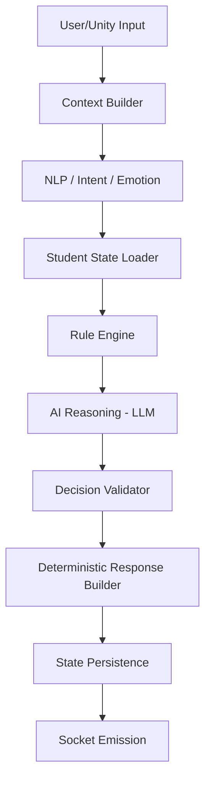

# System Architecture: Virtual Classroom

## Overview
A high-performance, real-time AI classroom system with Unity as the primary visual client and FastAPI as the central decision engine ("The Brain").

## Component Map

### 1. Backend (FastAPI Brain)
- **API Layer**: REST for management, WebSocket for real-time.
- **AI Decision Pipeline**: Strict sequence of processing steps.
- **State Management**: Redis for session-level student states, DB for persistence.
- **Security**: JWT-based auth with Role-Based Access Control (RBAC).

### 2. Unity Client
- Visual representation of the classroom.
- Consumes strict JSON payloads via WebSocket.
- No local business logic or decision making.

### 3. Teacher Web Panel
- Production-grade UI for classroom management.
- Real-time monitoring and historical playback.

### 4. Debug Dashboard
- Internal developer tool for observability.
- Latency tracking, NLP traces, and reasoning logs.

## AI Decision Pipeline

## Data Persistence
- **Redis**: Fast, real-time student state (mood, attention).
- **Relational DB**: Long-term student logs, profiles, and lesson history.
