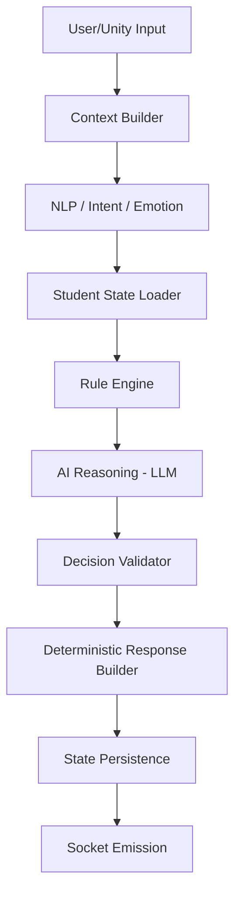

# System Architecture: Virtual Classroom

## Overview
A high-performance, real-time AI classroom system with Unity as the primary visual client and FastAPI as the central decision engine ("The Brain").

## Component Map

### 1. Backend (FastAPI Brain)
- **API Layer**: REST for management, WebSocket for real-time.
- **AI Decision Pipeline**: Strict sequence of processing steps.
- **State Management**: Redis for session-level student states, DB for persistence.
- **Security**: JWT-based auth with Role-Based Access Control (RBAC).

### 2. Unity Client
- Visual representation of the classroom.
- Consumes strict JSON payloads via WebSocket.
- No local business logic or decision making.

### 3. Teacher Web Panel
- Production-grade UI for classroom management.
- Real-time monitoring and historical playback.

### 4. Debug Dashboard
- Internal developer tool for observability.
- Latency tracking, NLP traces, and reasoning logs.

## AI Decision Pipeline

## 1. Command Authority & Conflict Resolution
- **Hierarchy**: `Teacher Manual Action (Web Panel)` > `AI Decision (Automatic)` > `Unity Default State`.
- **Conflict Strategy**: 
  - Teacher commands trigger an immediate "Override Flag" in the student's current state.
  - While an override is active (lock duration ~2000ms), automatic AI reasoning is bypassed to ensure teacher instruction is reflected instantly in Unity.
  - **Locks**: Each student has a mutex in Redis to prevent race conditions between simultaneous Web and AI emissions.

## 2. WebSocket Channel Design & Lifecycle
- **Unified Gateway**: `ws://v1/classroom/{room_id}`
- **Sub-Protocols/Roles**: Determined via JWT payload (`role: teacher`, `role: unity`, `role: debug`).
- **Lifecycle**:
  1. **Handshake**: standard HTTP upgrade with JWT in header/query.
  2. **Init**: Client sends `CLIENT_HELLO` with its capability manifest.
  3. **Heartbeat**: 30s interval `PING/PONG`.
  4. **State Sync**: Server sends current full classroom snapshot upon connection.
  5. **Termination**: Clean disconnect clears session ephemeral locks.

## 3. Decision Validator & Fallback Strategy
- **Validator Rules**:
  - `Safety Check`: Prompt-injection or toxic output filtered.
  - `Coherence Check`: Student cannot "Run" while state is "Sleeping".
  - `Contract Check`: Ensures mandatory JSON fields are present.
- **Fallbacks**:
  - If reasoning fails: Student returns `animation: "confused"`, `reply_text: "..."`.
  - If validation fails: Student enters `IDLE` state with a "System Recalibrating" log sent to Debug Panel.

## 4. Student State Transition Table
| Source Action | Affects | Change | New Mood/State |
| :--- | :--- | :--- | :--- |
| `Praise` | Attention, Mood | +0.2, Happy | Engaged |
| `Warn` | Attention, Energy | +0.3, Alert | Attentive |
| `Ignored` | Attention | -0.1 | Distracted |
| `Answering` | Energy | -0.1 | Neutral |
| `Long Silcence` | Attention | -0.2 | Bored/Sleepy |

## 5. Teacher Panel: Permissions & Audit
- **Permissions**:
  - `WRITE`: Send overrides, change lesson scenario, kick student agents.
  - `READ`: View student states, real-time analytics.
- **Audit Logging**:
  - All manual overrides are logged to `audit_logs` table with: `teacher_id`, `target_student`, `original_ai_decision_id`, `action_taken`, `timestamp`.

## 6. Security Model
- **Authentication**: JWT (HS256) for both REST and WS.
- **Authorization**:
  - `ROLE_TEACHER`: Access to Classroom controls.
  - `ROLE_DEBUG`: Access to RAW traces and AI reasoning logs (Internal only).
- **Network**: WebSockets require TLS in production (`wss://`).

## 7. Failure Handling & Degraded Modes
- **AI Engine Offline**: Backend falls back to the `Rule Engine` (hardcoded responses) immediately.
- **Redis Offline**: In-memory LRU cache stores active session states; sync to DB is deferred.
- **Unity Reconnect**: Automatically requests `GET_SNAPSHOT` to sync animations with current server-side state.

